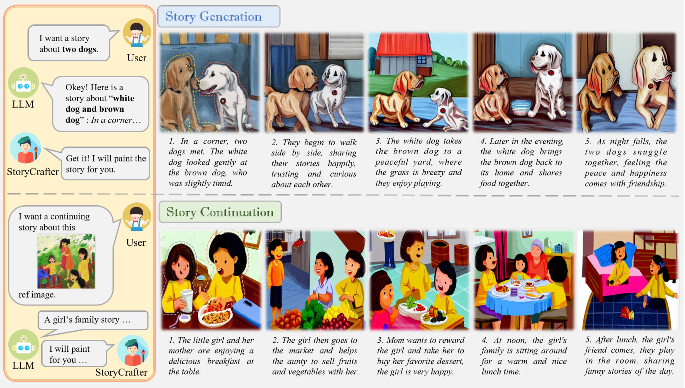

<div align="center">
  
# StoryCrafter: Instance-Aligned Multi-Character Storytelling withDiffusion Policy Learning 

> Ruiqi Dong, Wenjing Pang, Chenjie Pan, Heng-yang Lu, Chenyou Fan∗

</div>

<div align="center" style="font-family: Arial, sans-serif;">
  <p>
    <a href="#abstract" style="text-decoration: none; font-weight: bold;">Abstract</a> •
    <a href="#dataset" style="text-decoration: none; font-weight: bold;">Dataset</a> •
    <a href="#training" style="text-decoration: none; font-weight: bold;">Training</a> •
     <a href="#code-details" style="text-decoration: none; font-weight: bold;">Code Details</a> 
  </p>
</div>


##  Abstract

Open-ended visual storytelling presents a formidable challenge for current text-to-image models, which frequently struggle to preserve both narrative coherence and consistent character depictions across generated sequences.To address this, we introduce StoryCrafter, a multi-character diffusion model that leverages a novel instance-level cross-attention module with supervised fine-tuning to ensure precise text-character alignment and consistent multi-character interactions throughout the narrative. Further, we propose Direct-Diffusion Group Relative Policy Optimization (D2GRPO), a novel RLHF stage that optimizes denoising strategies using automated story-aligned rewards, selecting the best candidate frames from a generated group. We evaluate our approach through human assessments and vision language model (VLM) scoring, measuring text-to-image alignment, style and character consistency, and fine-grained detail quality. Experiments on three benchmarks demonstrate that StoryCrafter outperforms existing methods, achieving 7% improvements in storytelling consistency and 10% in character accuracy, while outperforming baselines in both human and VLM evaluations.

<div align="center">
   
</div>

## Dataset

For the open-source data, you can directly download from [StorySalon](https://huggingface.co/datasets/haoningwu/StorySalon).

## Requirements

- Python >= 3.8 (Recommend to use [Anaconda](https://www.anaconda.com/download/#linux) or [Miniconda](https://docs.conda.io/en/latest/miniconda.html))
- [PyTorch >= 1.12](https://pytorch.org/)

You can create an environment and install the required packages using pip:

```bash
pip install -r requirements.txt
```

## Training

Before training, please download pre-trained [StoryGen](https://huggingface.co/haoningwu/StoryGen) (including vae, scheduler, tokenizer and unet).

For Stage 1:

```python
CUDA_VISIBLE_DEVICES=0 accelerate launch train_SC_stage1.py
```

For Stage 2:

```
CUDA_VISIBLE_DEVICES=0 accelerate launch train_SC_stage2.py
```

## Inference

```python
CUDA_VISIBLE_DEVICES=0 accelerate launch inference_sc.py
```

## Code Details

- config.yml: Configure the training parameters of the model.

- train_SC_stage1/2.py: Implement the training logics.

- inference_sc.py: Reasoning process of the model.

- model: Important structure of the model, include: 

  - attention.py: Implement the attention mechanism used in the model.

  - pipeline.py: Contain the pipeline code that orchestrates the entire process of the model

  - unet_2d_blocks.py: Define the 2D blocks used in the U-Net block of the model.

  - unet_2d_condition.py: Implement the conditional 2D U-Net model.

- test_image.py:  Inference on the test sets.

- dataset.py: Data processing.

- data: We provide the data storage path format, detailed data can download StorySalon dataset.


## Citation

If you use this code for your research or project, please cite:

      @InProceedings{dong2025storycrafter,
            author    = {Dong, Ruiqi and Pang, Wenjing and Pan, Chenjie and Lu, Heng-yang and Fan, Chenyou},
            title     = {StoryCrafter: Instance-Aligned Multi-Character Storytelling with Diffusion Policy Learning},
            booktitle = {Proceedings of the 33rd ACM International Conference on Multimedia},
            year      = {2025},
            doi     = {10.1145/3746027.3755022}
      }


